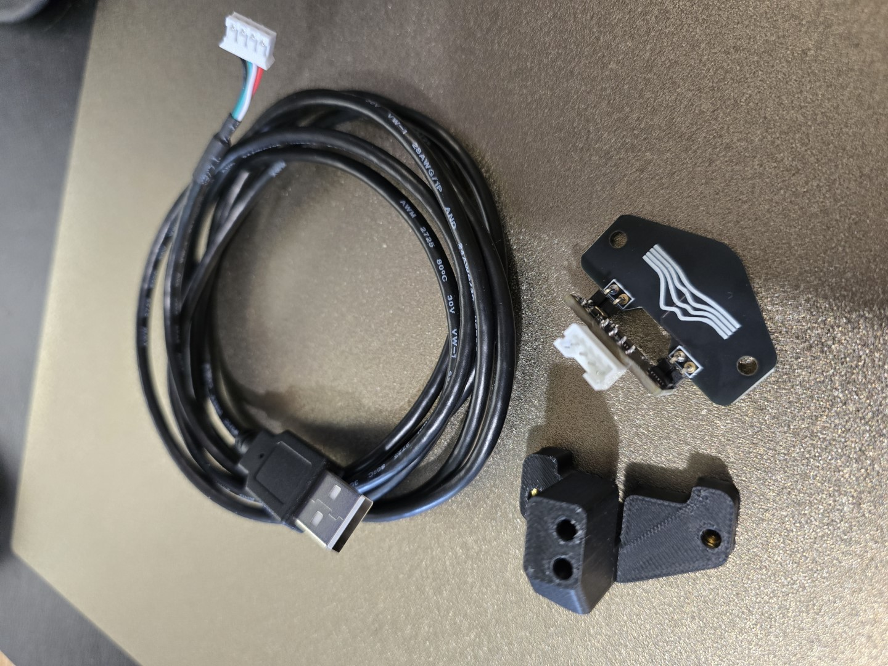
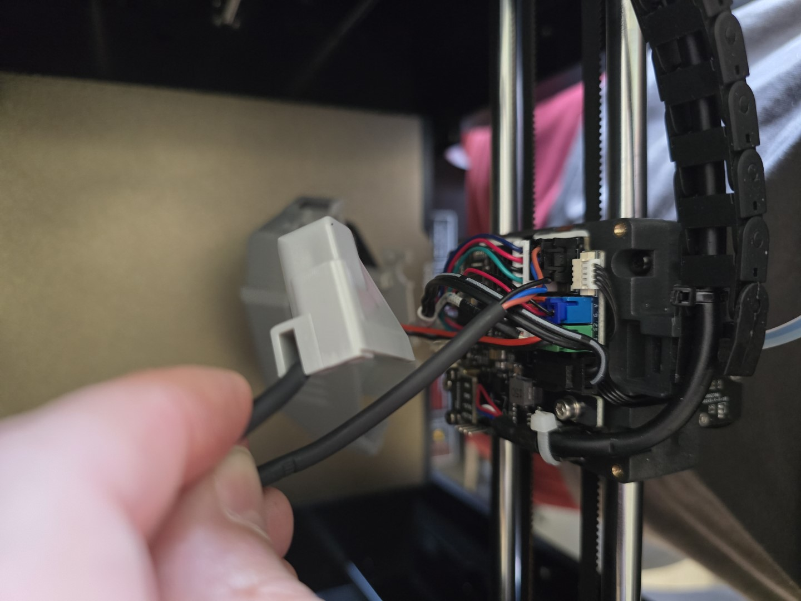
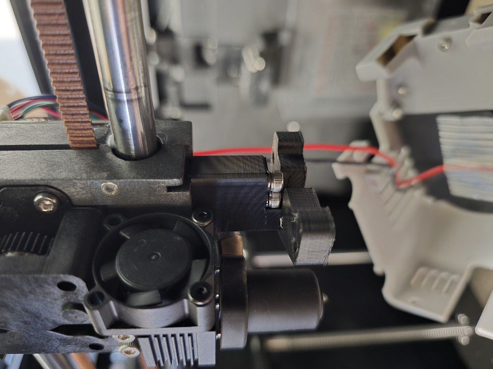
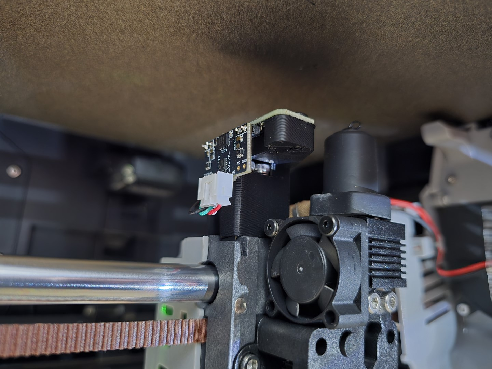
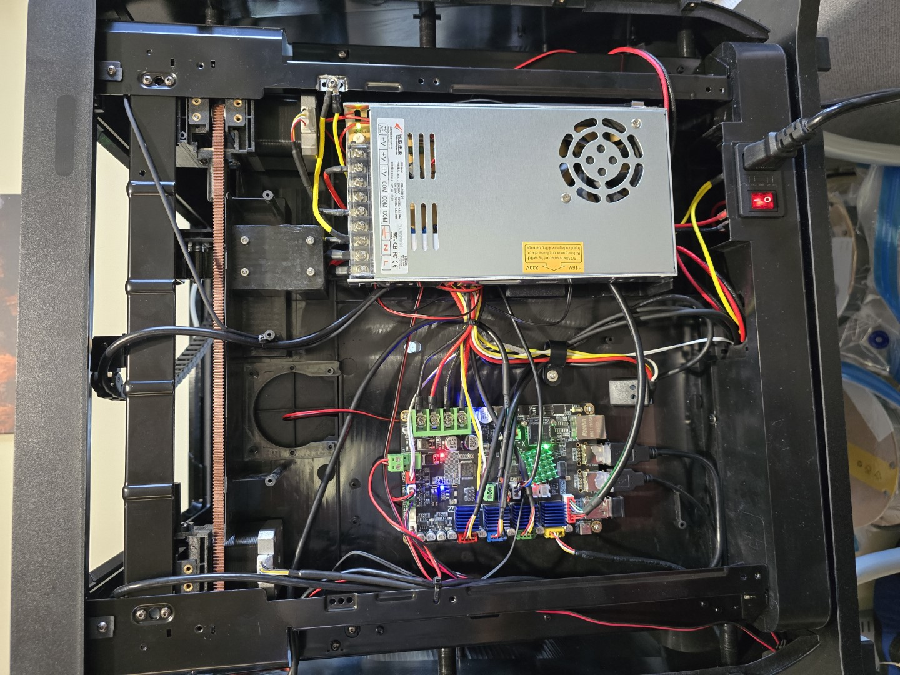
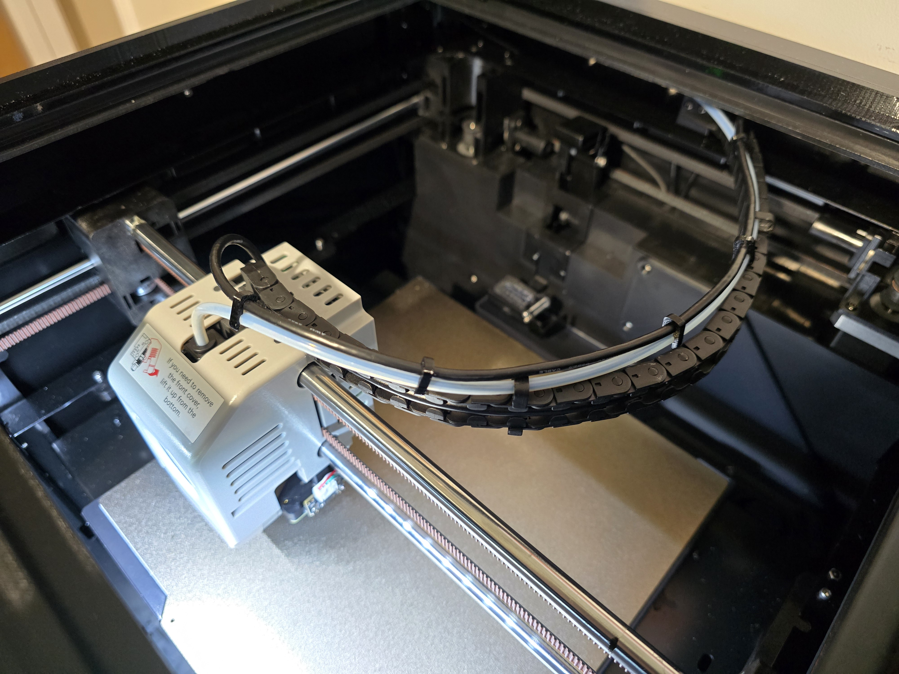
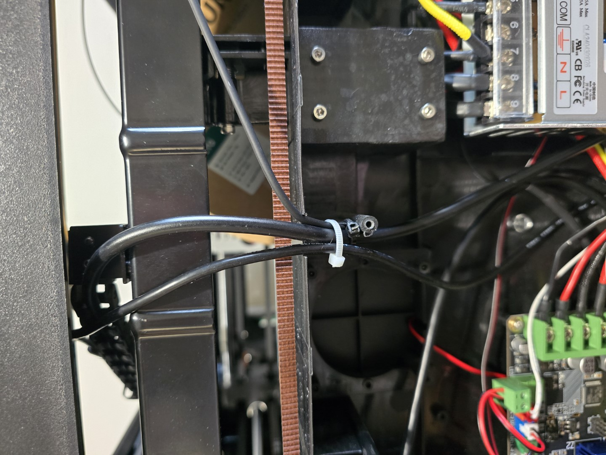
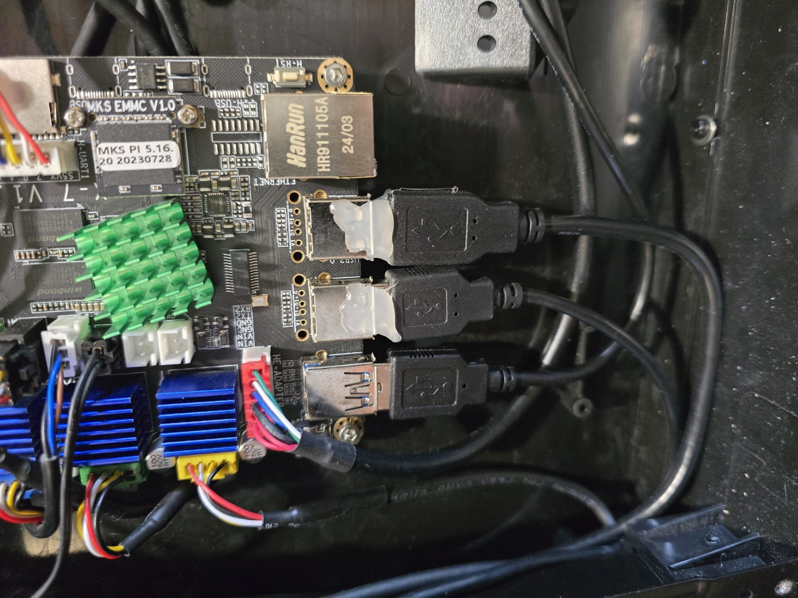

# Installing a Cartographer on a Qidi Q1 Pro
I could not find a comprehensive guide for installing a Cartographer probe on the Q1 Pro so have documented my installation here.

  

## Prerequisites
You need a few bits and pieces to get started.

  

### 1. Mainline Klipper
You should be on an up-to-date mainline Klipper installation. This means replacing the firmware on your printer with somthing like [FreeDi](https://github.com/Phil1988/FreeDi/) or [OpenQ1](https://github.com/frap129/OpenQ1/). Doing that is outside the scope of these instructions.

You *may* be able to do this on the stock Qidi firmware but I have not tried - my Q1 Pro runs FreeDi which works very well.

### 2. A Cartographer Probe
Obviously a Cartographer probe is required. You can buy one from [their website](https://cartographer3d.com).
- Get the [Right Angle](https://cartographer3d.com/products/cartographer-probe-v3-with-adxl345-right-angle-can-usb) version (or [Flat Pack](https://cartographer3d.com/products/cartographer-probe-v3-with-adxl345-flat-pack-both-can-usb) and assemble as right angle)
- Choose USB firmware preinstalled

**Note:** 
- The regular version of the Cartographer will work if you have one. The right angle is a cleaner fit.
- If you buy the flat pack and assemble it you will need to reverse the order of the pins in the JST connector on the USB cable
- Ensure that the pins on the underside of the probe are trimmed close to the probe - around 1mm - this is to ensure that they don't foul the nozzle wiper

### 3. A Mount for the Probe
Download and print the [Q1 Pro Cartographer mount](https://www.printables.com/model/1205523-qidi-q1-pro-cartographer-mount).

The mount works perfectly on my Q1 and the Cartographer does not foul the nozzle wiper.

### 4. A Free USB Port
The Cartographer probe connects via USB. Using it means using one of the three USB ports on the Q1 Pro, used by default for:
- External USB port on top of the printer
- Webcam
- WiFi dongle

My printer is connected via an Ethernet cable so I removed the WiFi dongle and used that port.

**Note:** Using a hub is **not** reccomended for the Cartographer.

## Installation
Installing the Cartographer probe is relatively straight forward.

### 1. Remove the Inductive Sensor
1. Ensure the printer is powered off
1. Lower the build plate to give room to access the underside of the toolhead with the hex driver
1. Remove the front toolhead cover by lifting up
1. Remove the rear toolhead cover by removing four hex bolts
1. Undo the two hex bolts which hold the inductive sensor in place
1. Cut the cable tie which secures the inductive probe cable at the bottom of the toolhead board
1. Unplug the inductive probe from the toolhead board (black JST connector)
1. Set the probe aside, keep the hex bolts

  

### 2. Mount the Cartographer

1. Use the hex bolts from the inductive probe to attach the Cartographer mount to the toolhead

  

2. Use the two short flat-head hex bolts supplied with the Cartographer to attach the probe to the mount
2. Attach the USB cable to the Cartographer probe

  

4. Route the USB cable underneath the toolhead board and out through the top, next to the cable chain attachment
2. Reattach the toolhead covers

### 3. Route and Connect the USB Cable
The USB cable isn't rated to go through the cable chain. I attached it to the Bowden tube. You could use cable ties but I printed some small clips.

1. Remove the back panel from the printer

  

2. Route the USB cable from the toolhead into the rear section by attaching it to the Bowden tube then passing it over the metal frame alongside the toolhead serial cable.

  

3. Widen the notch in the plastic panel where the toolhead cable passes through to also accomodate the Cartographer's USB cable - use a cable tie to keep the cables together

  

4. Thread the cable towards the USB ports at the bottom of the main board
5. Plug the USB connector into the USB port of your choice

  

### 4. Configure Klipper
Follow the [Cartographer documentation](https://docs.cartographer3d.com/) to [configure Klipper](https://docs.cartographer3d.com/cartographer-probe/installation-and-setup/installation/klipper-setup) to use the Cartographer.

**Note:** The documentation says to use `/dev/serial/by-id` to find the ID of the Cartographer. My printer did not have this path so I used `sudo dmesg` after plugging the probe in to identify that it was `/dev/ttyACM0`.
