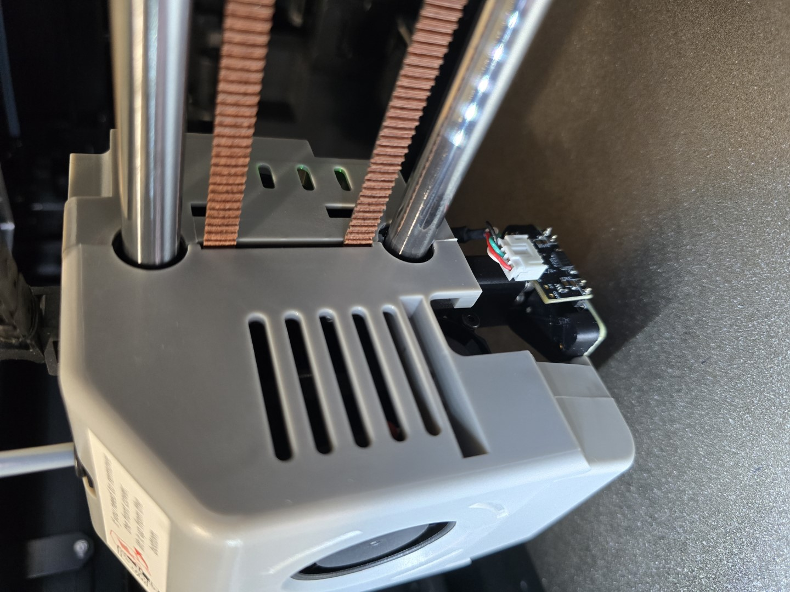

# Installing a Cartographer on a Qidi Q1 Pro
I could not find a comprehensive guide for installing a Cartographer probe on the Q1 Pro so have documented my installation here.

  

## Prerequisites
You need a few bits and pieces to get started.
### 1. Mainline Klipper
You should be on an up-to-date mainline Klipper installation. This means replacing the firmware on your printer with somthing like [FreeDi](https://github.com/Phil1988/FreeDi/) or [OpenQ1](https://github.com/frap129/OpenQ1/). Doing that is outside the scope of these instructions.

You *may* be able to do this on the stock Qidi firmware but I have not tried - my Q1 Pro runs FreeDi which works very well.

### 2. A Cartographer Probe
Obviously a Cartographer probe is required. You can buy one from [their website](https://cartographer3d.com).
- Get the Right Angle version (or Flat Pack and assemble as right angle)
- Choose USB firmware preinstalled

**Note:** 
- If you buy the flat pack and assemble it you will need to reverse the order of the pins in the JST connector on the USB cable
- Ensure that the pins on the underside of the probe are trimmed close to the probe - around 1mm - this is to ensure that they don't foul the nozzle wiper

### 3. A Mount for the Probe
Download and print the [Q1 Pro Cartographer mount](https://www.printables.com/model/1205523-qidi-q1-pro-cartographer-mount).

The mount works perfectly on my Q1 and the Cartographer does not foul the nozzle wiper.

### 4. A Free USB Port
The Cartographer probe connects via USB. Using it means using one of the three USB ports on the Q1 Pro, used by default for:
- External USB port on top of the printer
- Webcam
- WiFi dongle

My printer is connected via an Ethernet cable so I removed the WiFi dongle and used that port.

**Note:** Using a hub is **not** reccomended for the Cartographer.

## Installation
Installing the Cartographer probe is relatively straight forward.

### 1. Remove the Inductive Sensor

### 2. Mount the Cartographer

### 3. Route the USB Cable

### 4. Configure Klipper
